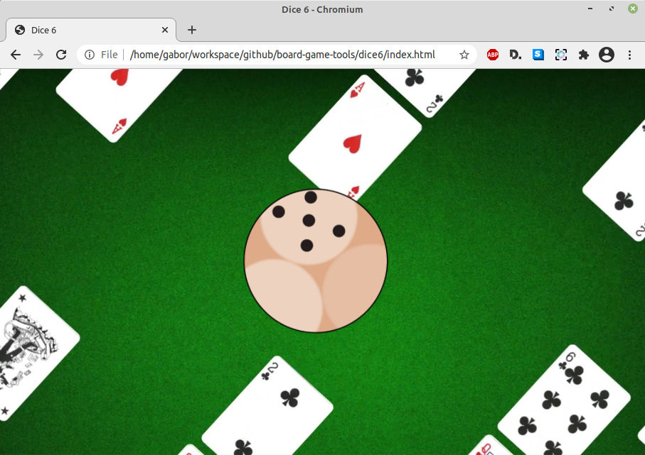
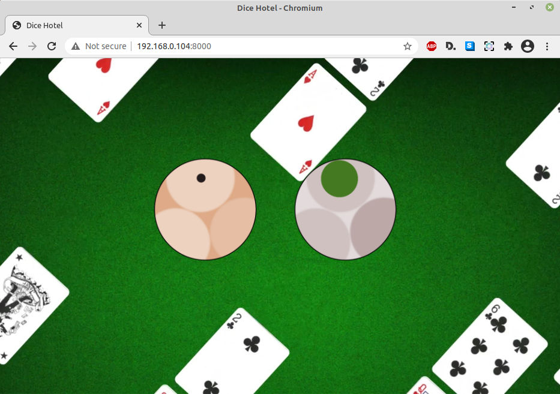

# board-game-tools
Just a couple of web based helpers - like a virtual dice - for playing various board games.

## Contents

- [Six Sided Dice (D6)](#six-sided-dice-d6)
- [Hotels (D6 + Lot)](#hotels-d6-+-lot)

## Six Sided Dice (D6)

This one is pretty lean. Simply navigate to the "dice6" folder and open "index.html" in a browser of your choice. To make the experience as immersive as it can possibly get, press F11 to make the browser full screen.

1. To begin your throw press any key, click or tap anywhere on the screen.
2. To stop the throw, again press any key, click or tap.
3. Read the number and play as usual on the board ;)

Patched, so current revision is more friendly for non readily caching servers/browsers (e.g. php built in server VS Chrome on Android).

## Hotels (D6 + Lot)

This one was designed for the popular board game called Hotel. It includes a six sided dice, and a lot purchase dice. Simply navigate to the "hotel" folder and open "index.html" in a browser of your choice. To make the experience as immersive as it can possibly get, press F11 to make the browser full screen.

1. To begin your throw click or tap on the dice you wish to throw.
2. To stop the throw, again click or tap on the dice.
3. Read the result and play as usual on the board ;)